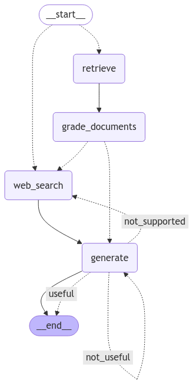
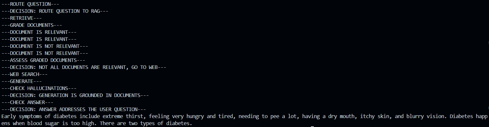

# MediSense-AI

## Description
Using LangGraph to build agentic workflow based on
- Corrective-RAG (CRAG) paper uses self-grading on retrieved documents and web-search fallback if documents are not relevant.
- Self-RAG paper adds self-grading on generations for hallucinations and for ability to answer the question.
- Adaptive RAG paper routes queries between different RAG approaches based on their complexity.


LangGraph built-in mermaid visualization


## Installation

To get started, follow these steps:

1. **Clone the repository**:
    ```sh
    git clone https://github.com/Rohit131313/MediSense-AI.git
    cd MediSense-AI
    ```
2. **Create a new Conda environment**
    ```sh
    conda create --name my_env python=3.9 -y
    conda activate my_env
    ```

3. **Install dependencies**:
    ```sh
    pip install -r requirements.txt
    ```

4. **Set up environment variables**:
    Create a `.env` file in the root directory and add necessary environment variables.
    ```sh
    GOOGLE_API_KEY 
    PINECONE_API_KEY
    TAVILY_API_KEY 
    ```

## Usage

Provide your question in main.py file:
```sh
Example:- question = "What are the symptoms of diabetes?"
```

To run the main application:

```sh
cd MediSense-AI
python main.py
```

Then you will see the output in terminal with the flow of steps model is performing like shown in image below

